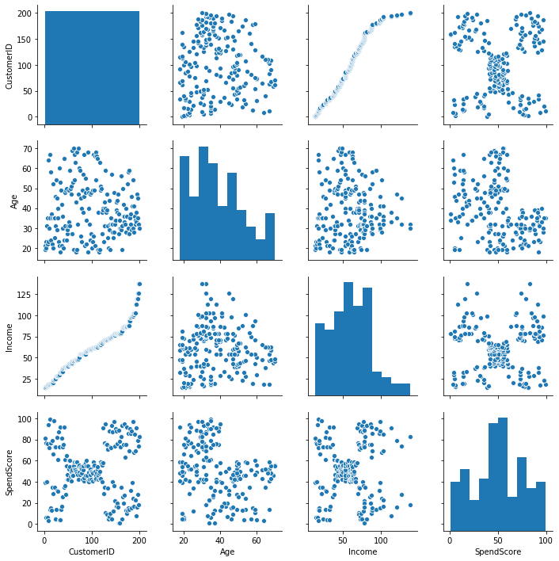
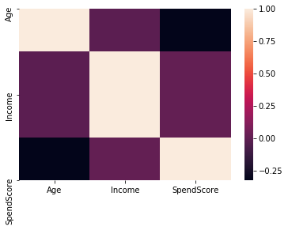
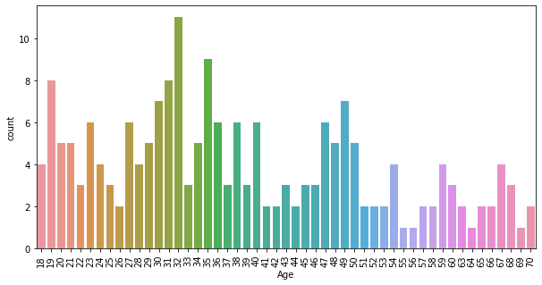
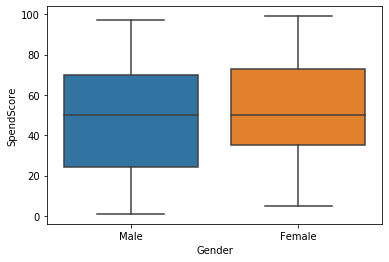
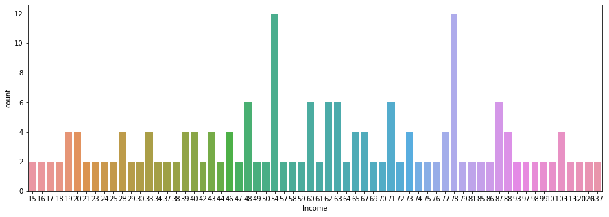
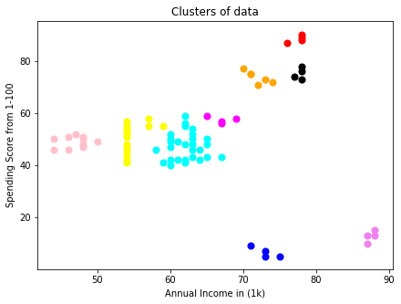
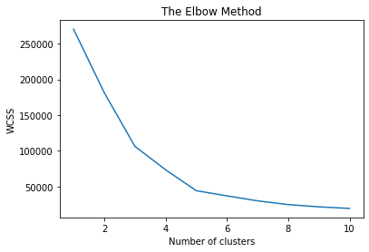
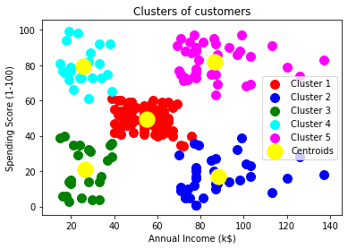

# Implementation of Clustering Algorithms to offer Business Insights.
## Motive- Customer Segmentation

### ABSTRACT
The project aims to **implement clustering algorithms to offer business insights**.
Clustering is the task of dividing the population or data points into a number of
groups such that data points in the same groups are more similar to other data points
in the same group than those in other groups. In simple words, the aim is to segregate
groups with similar traits and assign them into clusters. Today many businesses
generate a lot of data. Clustering can help businesses to manage their data better –
Customer segmentation, grouping web pages, market segmentation and information
retrieval are four examples. For retail businesses, data clustering helps with customer
shopping behavior, sales campaigns and customer retention. In the insurance
industry, clustering is regularly employed in fraud detection, risk factor
identification and customer retention efforts. In banking, clustering is used for
customer segmentation, credit scoring and analyzing customer profitability.

### In this project three different clustering algorithms are used.
1. DBSCAN Clustering
1. Hierarchical Clustering
1. K-means Clustering

### DBSCAN
Density Based Spacial Clustering of Applications with noise.
We are going to use the DBSCAN for algorithm for the purpose of clustering. 
It is an unsupervised machine learning algorithm.
It is used for clusters of high density. It automatically predicts the outliers and removes it. 
It is better than hierarchical and k-means clustering algorithm. 
It makes the clusters based on the parameters like epsilon,min points and noise.
It separately predicts the core points, border points and outliers efficiently.

### Advantages
* Is great at separating clusters of high density versus clusters of low density within a given dataset.
* Is great with handling outliers within the dataset.

## Disadvantages
* While DBSCAN is great at separating high density clusters from low density clusters, DBSCAN struggles with clusters of similar density.
* Struggles with high dimensionality data. I know, this entire article I have stated how DBSCAN is great at contorting the data into different dimensions and shapes. However, DBSCAN can only go so far, if given data with too many dimensions, DBSCAN suffers

### Hierarchical Clustering
Agglomerative Hierarchical clustering -This algorithm  works by  grouping  the data one by one on the basis of the  nearest distance measure of all the pairwise distance between the data point. Again distance between the data point is recalculated but which distance to consider when the groups has been formed? For this there are many available methods. Some of them are:
1. single-nearest distance or single linkage.
1. complete-farthest distance or complete linkage.
1. average-average distance or average linkage.
1. centroid distance.
1. ward's method - sum of squared euclidean distance is minimized.
This way we go on grouping the data until one cluster is formed. Now on the basis of dendogram graph we can calculate how many number of clusters should be actually present.

### Advantages
* First, we do not need to specify the number of clusters required for the algorithm.
* Second, hierarchical clustering is easy to implement.
* And third, the dendrogram produced is very useful in understanding the data.


### Disadvantages
* First, the algorithm can never undo any previous steps. So for example, the algorithm clusters 2 points, and later on we see that the connection was not a good one, the program cannot undo that step.
* Second, the time complexity for the clustering can result in very long computation times, in comparison with efficient algorithms, such k-Means.
* Finally, if we have a large dataset, it can become difficult to determine the correct number of clusters by the dendrogram.


### K-means Clustering
K-Means clustering algorithm is defined as a unsupervised learning methods having an iterative process
in which the dataset are grouped into k number of predefined non-overlapping clusters or subgroups making
the inner points of the cluster as similar as possible while trying to keep the clusters at distinct space
it allocates the data points to a cluster so that the sum of the squared distance between the clusters centroid
and the data point is at a minimum, at this position the centroid of the cluster is the arithmetic mean 
of the data points that are in the clusters.
This algorithm is an iterative algorithm that partitions the dataset according to their features into K number of predefined non- overlapping distinct clusters or subgroups. 
It makes the data points of inter clusters as similar as possible and also tries to keep the clusters as far as possible. 
It allocates the data points to a cluster if the sum of the squared distance between the cluster’s centroid and the data points is at a minimum where the cluster’s centroid is the arithmetic mean of the data points that are in the cluster.
A less variation in the cluster results in similar or homogeneous data points within the cluster.

### Advantages
* It is fast,Robust,Flexible,Easy to understand & Comparatively efficient
* If data sets are distinct then gives the best results
* Produce tighter clusters
* When centroids are recomputed the cluster changes.
* Easy to interpret
* Better computational cost
* Enhances Accuracy
* Works better with spherical clusters

### Disadvantages
* Needs prior specification for the number of cluster centers
* If there are two highly overlapping data then it cannot be distinguished and cannot tell that there are two clusters
* With the different representation of the data, the results achieved are also different
* Euclidean distance can unequally weight the factors
* It gives the local optima of the squared error function
* Sometimes choosing the centroids randomly cannot give fruitful results

```python
df=pd.read_csv("Mall_Customers.csv")
```


```python
df.head()
```


    .dataframe tbody tr th {
        vertical-align: top;
    }

    .dataframe thead th {
        text-align: right;
    }

<table border="1" class="dataframe">
  <thead>
    <tr style="text-align: right;">
      <th></th>
      <th>CustomerID</th>
      <th>Gender</th>
      <th>Age</th>
      <th>Annual Income (k$)</th>
      <th>Spending Score (1-100)</th>
    </tr>
  </thead>
  <tbody>
    <tr>
      <td>0</td>
      <td>1</td>
      <td>Male</td>
      <td>19</td>
      <td>15</td>
      <td>39</td>
    </tr>
    <tr>
      <td>1</td>
      <td>2</td>
      <td>Male</td>
      <td>21</td>
      <td>15</td>
      <td>81</td>
    </tr>
    <tr>
      <td>2</td>
      <td>3</td>
      <td>Female</td>
      <td>20</td>
      <td>16</td>
      <td>6</td>
    </tr>
    <tr>
      <td>3</td>
      <td>4</td>
      <td>Female</td>
      <td>23</td>
      <td>16</td>
      <td>77</td>
    </tr>
    <tr>
      <td>4</td>
      <td>5</td>
      <td>Female</td>
      <td>31</td>
      <td>17</td>
      <td>40</td>
    </tr>
  </tbody>
</table>
</div>


```python
df.info()
```

    <class 'pandas.core.frame.DataFrame'>
    RangeIndex: 200 entries, 0 to 199
    Data columns (total 5 columns):
    CustomerID                200 non-null int64
    Gender                    200 non-null object
    Age                       200 non-null int64
    Annual Income (k$)        200 non-null int64
    Spending Score (1-100)    200 non-null int64
    dtypes: int64(4), object(1)
    memory usage: 7.9+ KB
    


```python
df.describe()
```


    .dataframe tbody tr th {
        vertical-align: top;
    }

    .dataframe thead th {
        text-align: right;
    }

<table border="1" class="dataframe">
  <thead>
    <tr style="text-align: right;">
      <th></th>
      <th>CustomerID</th>
      <th>Age</th>
      <th>Annual Income (k$)</th>
      <th>Spending Score (1-100)</th>
    </tr>
  </thead>
  <tbody>
    <tr>
      <td>count</td>
      <td>200.000000</td>
      <td>200.000000</td>
      <td>200.000000</td>
      <td>200.000000</td>
    </tr>
    <tr>
      <td>mean</td>
      <td>100.500000</td>
      <td>38.850000</td>
      <td>60.560000</td>
      <td>50.200000</td>
    </tr>
    <tr>
      <td>std</td>
      <td>57.879185</td>
      <td>13.969007</td>
      <td>26.264721</td>
      <td>25.823522</td>
    </tr>
    <tr>
      <td>min</td>
      <td>1.000000</td>
      <td>18.000000</td>
      <td>15.000000</td>
      <td>1.000000</td>
    </tr>
    <tr>
      <td>25%</td>
      <td>50.750000</td>
      <td>28.750000</td>
      <td>41.500000</td>
      <td>34.750000</td>
    </tr>
    <tr>
      <td>50%</td>
      <td>100.500000</td>
      <td>36.000000</td>
      <td>61.500000</td>
      <td>50.000000</td>
    </tr>
    <tr>
      <td>75%</td>
      <td>150.250000</td>
      <td>49.000000</td>
      <td>78.000000</td>
      <td>73.000000</td>
    </tr>
    <tr>
      <td>max</td>
      <td>200.000000</td>
      <td>70.000000</td>
      <td>137.000000</td>
      <td>99.000000</td>
    </tr>
  </tbody>
</table>
</div>


```python
df.rename(columns={'Annual Income (k$)':'Income','Spending Score (1-100)':'SpendScore'},inplace=True)
```


```python
df.head()
```


    .dataframe tbody tr th {
        vertical-align: top;
    }

    .dataframe thead th {
        text-align: right;
    }

<table border="1" class="dataframe">
  <thead>
    <tr style="text-align: right;">
      <th></th>
      <th>CustomerID</th>
      <th>Gender</th>
      <th>Age</th>
      <th>Income</th>
      <th>SpendScore</th>
    </tr>
  </thead>
  <tbody>
    <tr>
      <td>0</td>
      <td>1</td>
      <td>Male</td>
      <td>19</td>
      <td>15</td>
      <td>39</td>
    </tr>
    <tr>
      <td>1</td>
      <td>2</td>
      <td>Male</td>
      <td>21</td>
      <td>15</td>
      <td>81</td>
    </tr>
    <tr>
      <td>2</td>
      <td>3</td>
      <td>Female</td>
      <td>20</td>
      <td>16</td>
      <td>6</td>
    </tr>
    <tr>
      <td>3</td>
      <td>4</td>
      <td>Female</td>
      <td>23</td>
      <td>16</td>
      <td>77</td>
    </tr>
    <tr>
      <td>4</td>
      <td>5</td>
      <td>Female</td>
      <td>31</td>
      <td>17</td>
      <td>40</td>
    </tr>
  </tbody>
</table>
</div>


```python
sns.pairplot(df)
```


    <seaborn.axisgrid.PairGrid at 0x20d59430908>




**From the above diagram, we can say that the customer id is not correlated with income, it's not an useful feature so we can remove that.**


```python
df=df.drop(['CustomerID'],axis=1)
```


```python
df.head()
```


    .dataframe tbody tr th {
        vertical-align: top;
    }

    .dataframe thead th {
        text-align: right;
    }

<table border="1" class="dataframe">
  <thead>
    <tr style="text-align: right;">
      <th></th>
      <th>Gender</th>
      <th>Age</th>
      <th>Income</th>
      <th>SpendScore</th>
    </tr>
  </thead>
  <tbody>
    <tr>
      <td>0</td>
      <td>Male</td>
      <td>19</td>
      <td>15</td>
      <td>39</td>
    </tr>
    <tr>
      <td>1</td>
      <td>Male</td>
      <td>21</td>
      <td>15</td>
      <td>81</td>
    </tr>
    <tr>
      <td>2</td>
      <td>Female</td>
      <td>20</td>
      <td>16</td>
      <td>6</td>
    </tr>
    <tr>
      <td>3</td>
      <td>Female</td>
      <td>23</td>
      <td>16</td>
      <td>77</td>
    </tr>
    <tr>
      <td>4</td>
      <td>Female</td>
      <td>31</td>
      <td>17</td>
      <td>40</td>
    </tr>
  </tbody>
</table>
</div>


```python
sns.heatmap(df.corr())
```


    <matplotlib.axes._subplots.AxesSubplot at 0x20d5a09e708>





```python
plt.figure(figsize=(7,7))
size=df['Gender'].value_counts()
label=['Female','Male']
color=['Pink','Blue']
explode=[0,0.1]
plt.pie(size,explode=explode,labels=label,colors=color,shadow=True)
plt.legend()
plt.show()
```


**From the diagram we can say that females are more visiting to mall than males**


```python
plt.figure(figsize=(10,5))
sns.countplot(df['Age'])
plt.xticks(rotation=90)
```


    (array([ 0,  1,  2,  3,  4,  5,  6,  7,  8,  9, 10, 11, 12, 13, 14, 15, 16,
            17, 18, 19, 20, 21, 22, 23, 24, 25, 26, 27, 28, 29, 30, 31, 32, 33,
            34, 35, 36, 37, 38, 39, 40, 41, 42, 43, 44, 45, 46, 47, 48, 49, 50]),
     <a list of 51 Text xticklabel objects>)




**Peoples of age between 25 to 40 are mostly visiting mall than other age groups**

```python
sns.boxplot(df['Gender'],df['SpendScore'])
```


    <matplotlib.axes._subplots.AxesSubplot at 0x20d5a2f4848>




**This diagram shows the mean spendscore of female and male. we can observe that the mean average spend score of female is greater than male, they have higher spendscore than male,and their least spendscore is greater than males least spendscore**

```python
plt.figure(figsize=(15,5))
sns.countplot(df['Income'])
```


    <matplotlib.axes._subplots.AxesSubplot at 0x20d593b9d08>




**Peoples of salary 54k and 78k are the mostly visited persons in mall.**


```python
plt.bar(df['Income'],df['SpendScore'])
plt.title('Spendscore over income',fontsize=20)
plt.xlabel('Income')
plt.ylabel('Spendscore')
```


    Text(0, 0.5, 'Spendscore')


**Peoples of income in the range of 20k-40k and 70k-100k have the highest spend score**

```python
df.head()
```


    .dataframe tbody tr th {
        vertical-align: top;
    }

    .dataframe thead th {
        text-align: right;
    }

<table border="1" class="dataframe">
  <thead>
    <tr style="text-align: right;">
      <th></th>
      <th>Gender</th>
      <th>Age</th>
      <th>Income</th>
      <th>SpendScore</th>
    </tr>
  </thead>
  <tbody>
    <tr>
      <td>0</td>
      <td>Male</td>
      <td>19</td>
      <td>15</td>
      <td>39</td>
    </tr>
    <tr>
      <td>1</td>
      <td>Male</td>
      <td>21</td>
      <td>15</td>
      <td>81</td>
    </tr>
    <tr>
      <td>2</td>
      <td>Female</td>
      <td>20</td>
      <td>16</td>
      <td>6</td>
    </tr>
    <tr>
      <td>3</td>
      <td>Female</td>
      <td>23</td>
      <td>16</td>
      <td>77</td>
    </tr>
    <tr>
      <td>4</td>
      <td>Female</td>
      <td>31</td>
      <td>17</td>
      <td>40</td>
    </tr>
  </tbody>
</table>
</div>


```python
label
```


    array([-1, -1, -1, -1, -1, -1, -1, -1, -1, -1, -1, -1, -1, -1, -1, -1, -1,
           -1, -1, -1, -1, -1, -1, -1, -1, -1, -1, -1, -1, -1, -1, -1, -1, -1,
           -1, -1, -1, -1, -1, -1, -1, -1, -1, -1, -1, -1, -1, -1, -1, -1, -1,
           -1, -1, -1, -1, -1,  0,  0,  0,  0, -1, -1,  0, -1,  0, -1,  0,  0,
           -1,  0, -1, -1,  0, -1,  1,  1,  1,  1,  1,  1,  1,  1,  1,  1,  1,
            1,  1,  1, -1,  2,  1,  2,  2,  2,  2,  2,  2,  2,  2,  2,  2,  2,
            2,  2,  2,  2,  2,  2,  2,  2,  2,  2,  2,  2,  2,  2,  2,  3,  2,
            3,  3, -1,  3, -1, -1,  4, -1, -1, -1,  4,  5,  4, -1,  4,  5, -1,
            5,  4, -1,  4,  5, -1, -1,  6, -1, -1, -1,  7, -1,  6, -1,  6, -1,
            7, -1,  6, -1,  7, -1,  7, -1, -1, -1, -1, -1, -1, -1, -1, -1, -1,
            8, -1,  8, -1,  8, -1,  8, -1, -1, -1, -1, -1, -1, -1, -1, -1, -1,
           -1, -1, -1, -1, -1, -1, -1, -1, -1, -1, -1, -1, -1], dtype=int64)


    No of clusters: 9
    
# DBSCAN Cluster




*It is an unsupervised machine learning algorithm. It is used for clusters of high density. It automatically predicts the outliers and removes it. It is better than hierarchical and k-means clustering algorithm. It makes the clusters based on the parameters like epsilon,min points and noise.It separately predicts the core points, border points and outliers efficiently.*


# HIERARCHICAL CLUSTERING
    


# K-means Clutering
    







## Steps to run the code
1. Download and install Anaconda Navigator.
1. Clone and extract contents of this repository.
1. Open Jupyter Notebook
1. Navigate to the directory where you have extracted the contents of this repository.
1. Open **CustomerSegmentation.ipynb** file.
1. Analyse the data.Feel free to make any changes in the code as per your preference.
GOOD LUCK!!
